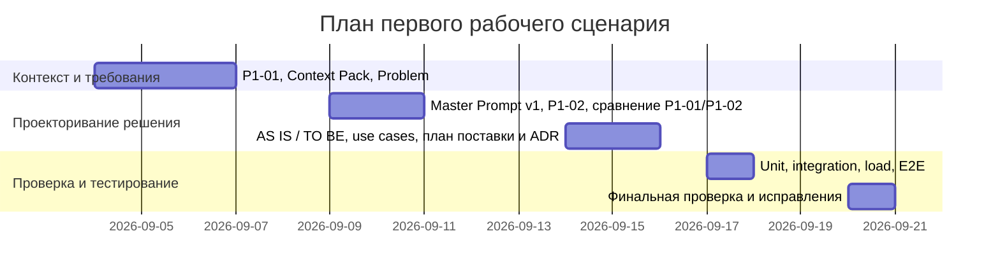

# План поставки

Файл ведёт OpenCode. Обсудите с агентом содержание и проверьте предложенный diff. Все дополнения и исправления поручайте агенту в чате.

## Инкременты и ответственность

| Инкремент | Наблюдаемый результат | Что делает человек | Что делает AI или субагент | Проверка | Зависимости |
|---|---|---|---|---|---|
| Контекст и требования | Заполнены `context.md` (AS IS, Context Pack) и `problem.md` (проблема и метрики); зафиксированы P1-01/P1-02 | Уточняет факты, подтверждает ограничения (пользователь, формат результата, лимиты) | Готовит и обновляет `context.md` и `problem.md` по подтвержденным источникам; сохраняет результаты P1-01/P1-02 | Ручная проверка соответствия требованиям из `context.md` и метрикам из `problem.md` | — |
| Проекторивание решения | Оформлены `analysis.md` (AS IS/TO BE), `product_management.md` (use case, user stories); обновлён `project_management.md` (план) | Принимает TO BE, сценарии и критерии; даёт правки по формату | Консолидирует AS IS/TO BE и сценарии из согласованных файлов; обновляет план поставки | Кросс-проверка связности: TO BE согласован с метриками и ограничениями; сценарии соответствуют `context.md` | Контекст и требования |
| Проверка и тестирование | Подготовлены сценарии проверок: unit, integration, load, E2E (структурно согласованы с метриками) | Уточняет критерии приёма, утверждает списки проверок | Подготавливает шаблоны тестов и перечень проверок в согласованной структуре | Валидация против метрик `problem.md` и ограничений `context.md`; интеграционная проверка контрактов | Проекторивание решения |

## Диаграмма Ганта

Передайте OpenCode даты и задачи своего плана и попросите обновить диаграмму.

## Как использовали AI

- Для чего: сформировать план поставки по согласованным артефактам (контекст, проблема, анализ, продуктовые сценарии) и зафиксировать инкременты.
- Тип промпта: инструкционный (редакторский) запрос на консолидацию плана без добавления незафиксированных требований.
- Строка в [`prompts.md`](prompts.md): P1-02 (context), P1-04 (analysis), P1-05 (product management) — см. соответствующие файлы.
- Что проверил студент и какие исправления поручил агенту: подтвердил даты и содержание этапов; задал три логических инкремента и план-график; поручил обновить диаграмму Ганта согласно плану.
